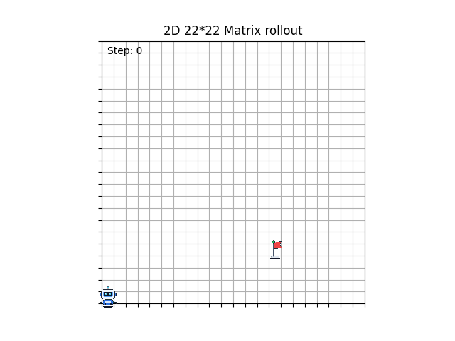
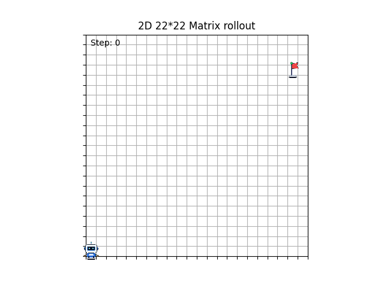

# DQN Grid World Reinforcement Learning Demo

[中文版](README.md)

A 2D Grid World reinforcement learning demo based on PyTorch and Gymnasium. It is designed to show how an agent learns state transitions, reward feedback, exploration strategies, and navigation paths in a discrete environment. The project implements DQN, random-goal navigation, experience replay, target networks, Double DQN, TensorBoard training logs, and GIF path visualization.

## Demos and Results

During training, evaluation trajectory GIFs are saved periodically under `runs/`. The examples below show Double DQN evaluation results in the random-goal environment. The agent starts from the initial position and moves step by step toward the target flag according to the actions predicted by the Q network.

| Demo | Preview | Description |
| --- | --- | --- |
| Double DQN rollout 420 | [GIF](imgs/2Dworld_DQN_ran_dual_420_20260525141818.gif) | Path evaluation result around episode 420 |
| Double DQN rollout 480 | [GIF](imgs/2Dworld_DQN_ran_dual_480_20260525141829.gif) | Path evaluation result around episode 480 |

### Double DQN Rollout



This demo uses the random-goal environment. In each episode, the environment generates a goal position, and the agent selects actions based on its current position, the goal position, and relative-distance features.



## Features

- Custom 2D Grid World environment with an agent, goal, discrete action space, and termination conditions.
- Supports both fixed-goal and random-goal navigation tasks.
- DQN training pipeline implemented with PyTorch, including a Q network, experience replay, and epsilon-greedy exploration.
- Uses a target network to improve training stability.
- Implements Double DQN target estimation for the random-goal task.
- Supports reward shaping, including goal-reaching reward, step penalty, wall-hit penalty, and repeated-position penalty.
- Logs `Loss`, `TD Error`, `Q Mean`, `Q Max`, `Episode Steps`, and `Eval Success` with TensorBoard.
- Supports checkpoint saving, loading, resume training, and transfer initialization.
- Saves evaluation paths as GIFs for easier policy-learning inspection.

## Tech Stack

- Python 3.10
- PyTorch
- Gymnasium
- NumPy
- TensorBoard
- Matplotlib
- Pillow

## Project Structure

```text
.
|-- config/
|   `-- Config.py
|-- imgs/
|   |-- 2Dworld_DQN_ran_dual_420_20260525141818.gif
|   |-- 2Dworld_DQN_ran_dual_480_20260525141829.gif
|   |-- G.gif
|   |-- T.gif
|   `-- Ending.gif
|-- src/
|   |-- agents/
|   |   |-- dqn_net.py
|   |   |-- policies.py
|   |   `-- replay_buffer.py
|   |-- ani/
|   |   `-- animation_visualize.py
|   |-- ckp/
|   |   `-- ckp_functions.py
|   |-- data/
|   |   `-- run_context.py
|   |-- envs/
|   |   `-- matrix_world.py
|   |-- main/
|   |   |-- 2Dworld_DQN.py
|   |   |-- 2Dworld_DQN_ran.py
|   |   `-- 2Dworld_DQN_ran_dual.py
|   |-- trainers/
|   |   |-- dqn_trainer.py
|   |   |-- dqn_trainer_random.py
|   |   `-- dqn_trainer_dual.py
|   |-- uti/
|   `-- viz/
|-- ckps/
|-- runs/
|-- requirements.txt
|-- cpu_env_rl.yml
`-- gpu_env_rl.yml
```

### Main Logic

- `config/Config.py`: training episodes, learning rate, environment size, reward settings, GIF saving, and checkpoint parameters.
- `src/envs/matrix_world.py`: Grid World environment definition, including state, actions, rewards, and episode termination.
- `src/agents/dqn_net.py`: Q-network architecture.
- `src/agents/replay_buffer.py`: experience replay buffer.
- `src/agents/policies.py`: epsilon-greedy action selection.
- `src/trainers/dqn_trainer.py`: fixed-goal DQN training.
- `src/trainers/dqn_trainer_random.py`: random-goal DQN training.
- `src/trainers/dqn_trainer_dual.py`: random-goal Double DQN training.
- `src/ckp/ckp_functions.py`: model parameter saving and loading.
- `src/ani/animation_visualize.py`: GIF visualization for training evaluation paths.

## How to Run

### 1. Create a Conda Environment

```powershell
conda create -n env_rl python=3.10 -y
conda activate env_rl
```

### 2. Install Dependencies

```powershell
pip install -r .\requirements.txt
```

CPU version of PyTorch:

```powershell
pip install torch torchvision torchaudio --index-url https://download.pytorch.org/whl/cpu
```

GPU version of PyTorch:

```powershell
conda install -y pytorch torchvision torchaudio pytorch-cuda=12.1 -c pytorch -c nvidia
```

You can also recreate the environment from an environment file:

```powershell
conda env create -f cpu_env_rl.yml
conda activate env_rl
```

Or:

```powershell
conda env create -f gpu_env_rl.yml
conda activate env_rl
```

### 3. Run Training

Go to the project root:

```powershell
cd D:\Workspace\reinforce\DQN
```

Run the random-goal Double DQN entry:

```powershell
python -m src.main.2Dworld_DQN_ran_dual
```

Other entries:

```powershell
python -m src.main.2Dworld_DQN
python -m src.main.2Dworld_DQN_ran
```

### 4. View TensorBoard

```powershell
tensorboard --logdir runs
```

Then open this URL in a browser:

```text
http://localhost:6006/
```

## Configuration

The main parameters are located in:

```text
config/Config.py
```

### Training Parameters

```python
"training": {
    "episodes": 2000,
    "train_record_fre": 1000,
    "eval_performance_fre": 100,
    "train_mode": 2,
    "load_resume_file_path": "ckps\\best_1615.pt",
    "pt_save_enabled": True
}
```

- `episodes`: number of training episodes.
- `train_record_fre`: training-metric logging frequency, based on global step.
- `eval_performance_fre`: evaluation frequency, based on episode.
- `train_mode`:
  - `0`: train from scratch.
  - `1`: resume training in the same environment, loading the model, optimizer, epsilon, and global step.
  - `2`: transfer initialization, loading only the Q network and target network parameters.
- `pt_save_enabled`: whether to save checkpoints.

### Environment Parameters

```python
"environment": {
    "width": 20,
    "height": 20,
    "max_steps": 500
}
```

The random-goal version generates a new goal in each episode. The model input is:

```text
[x, y, gx, gy, dx, dy]
```

Here, `x, y` are the current position, `gx, gy` are the goal position, and `dx, dy` are the normalized relative distances.

### Reward Settings

```python
"rewards": {
    "goal_pos_reward": 10,
    "step_reward": -0.1,
    "hit_wall_enable": True,
    "hit_wall_reward": -1,
    "repeat_position_enable": True,
    "repeat_position_reward": -0.5
}
```

The reward function encourages the agent to reach the goal quickly while reducing wall hits and repeated back-and-forth movement.

### GIF Saving

```python
"animation": {
    "save_gif": True,
    "save_git_ep_start": 1800,
    "save_gif_ep": 45,
    "agent_img_dir": "imgs\\G.gif",
    "des_img_dir": "imgs\\T.gif",
    "end_img_path": "imgs\\Ending.gif",
    "ending_time": 10
}
```

In the current Double DQN trainer, GIF saving is triggered by the evaluation logic, so the actual saving frequency is mainly controlled by `eval_performance_fre`. GIFs are saved under the `runs/` subdirectory for the current training log.

## Checkpoints

Checkpoints are saved by default in:

```text
ckps/
```

Saved contents include:

- `q_net`
- `target_net`
- `optimizer`
- `episode`
- `epsilon`
- `global_step`

The current code saves checkpoints at a fixed frequency and does not automatically determine the best model. `best_1010.pt` and `best_1615.pt` are better understood as manually selected model files.

## Notes

- This project is mainly for understanding and visualizing reinforcement learning algorithms; it is not a complete reinforcement learning framework.
- The random-goal version uses a fixed 6-dimensional feature input, so it can continue training when transferred from `10x10` to `20x20`. If one-hot state input is used instead, changing the environment size will cause a network input-dimension mismatch.
- The `save_git_ep_start` field name keeps the spelling used in the current code. Do not rename it to `save_gif_ep_start`, or the trainer will not read it.
- `ani_dir` is currently not used. GIFs are saved under the training log directory in `runs/`.
- For GitHub display, consider cleaning `__pycache__`, temporary logs, and excessive checkpoints, keeping only necessary result GIFs and selected models.
